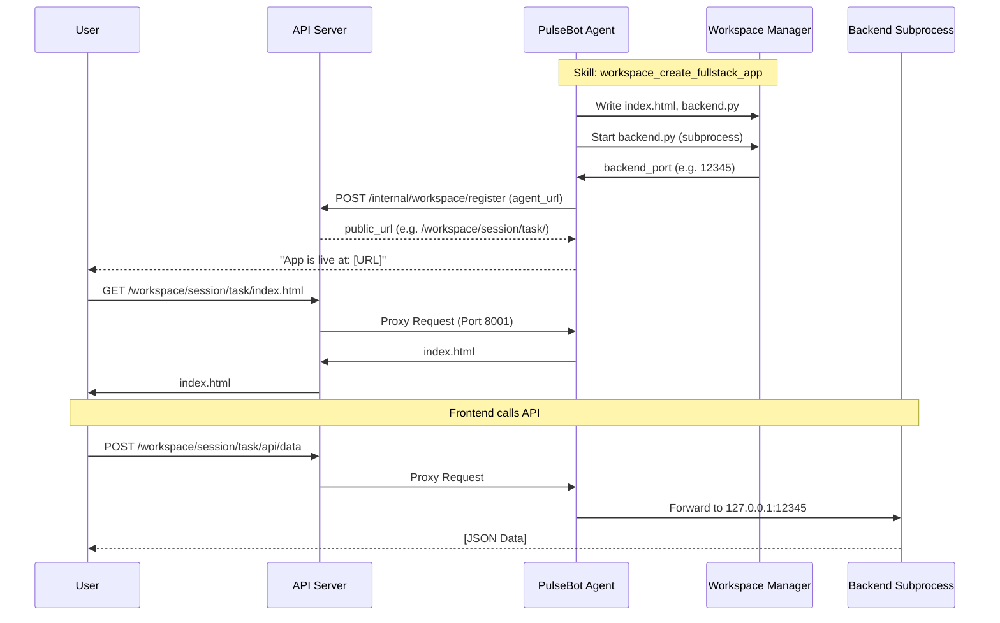

# Agent Workspace

The **Agent Workspace** is a feature in PulseBot that allows the agent to create, manage, and publish dynamic artifacts and runnable web applications. It enables the agent to go beyond simple text responses, providing interactive charts, dashboards, and full-stack tools that can be accessed directly from a browser.

## Architecture

The Workspace feature is split between the **Agent** (where code runs and files are stored) and the **API Server** (which provides public access via a proxy).



## Workspace Skill Implementation (`pulsebot/skills/builtin/workspace.py`)

The `WorkspaceSkill` is the LLM-facing interface for all workspace operations. It translates high-level tool calls into specific actions performed by the `WorkspaceManager` and `ProxyRegistryClient`.

### Internal Execution Flow

For most tools, the execution follows this pattern:
1. **Validation**: Check required arguments like `session_id`, `task_name`, etc.
2. **Manager Call**: Invoke `WorkspaceManager` to create the task and write files.
3. **Registration**: Invoke `ProxyRegistryClient.register()` to notify the API server.
4. **URL Construction**: Build a public URL using the `api_server_url` from config.
5. **Result**: Return a `ToolResult` containing the public URL and status message.

### Core Handlers

#### `_handle_write_file`
- Used for static artifacts (CSV, MD, HTML).
- Creates a task of type `file`.
- Writes the content to the specified filename.
- Returns a direct link to the file.

#### `_handle_create_app`
- Used for single-page interactive apps.
- Creates a task of type `html_app`.
- Writes the provided HTML to `index.html`.
- Returns a link to the task root (which serves `index.html`).

#### `_handle_create_fullstack_app`
- Used for apps requiring server-side logic.
- Creates a task of type `fullstack_app`.
- Writes `index.html`, `backend.py`, and optionally `requirements.txt`.
- Calls `WorkspaceManager.start_backend()` to launch the subprocess.
- Returns a public URL and the internal `backend_port` for debugging.

#### `_handle_start_app` / `_handle_stop_app`
- Controls the lifecycle of `fullstack_app` backends without deleting files.
- `start_app` handles port allocation and dependency installation via the manager.

### URL Construction Logic
The skill constructs public URLs by combining the API server's base URL with the session and task slugs:
`{api_server_url}/workspace/{session_id}/{task_id}/`

## Agent Components

### WorkspaceManager (`pulsebot/workspace/manager.py`)
The core engine running on the agent. It is responsible for:
- **On-disk layout**: Managing directories for each session and task.
- **Task Registry**: Keeping track of running sub-processes and their ports.
- **Subprocess Lifecycle**: Spawning, tracking, and terminating `backend.py` processes.
- **Dependency Management**: Automatically running `pip install` if a `requirements.txt` is provided.

### WorkspaceServer (`pulsebot/workspace/server.py`)
An embedded FastAPI server (defaulting to port `8001`) that runs inside the agent process. It serves:
- Static files (HTML, JS, CSS, CSV, etc.).
- A **Proton Query Proxy** (at `/query`) to bypass browser CORS restrictions.
- A **Reverse Proxy** that forwards `/api/*` requests to the specific backend subprocess for a task.

## API Server Components

### ProxyRegistry (`pulsebot/workspace/proxy_registry.py`)
An in-memory registry on the API server that maps `{session_id}/{task_id}` to the `agent_url`.

### WorkspaceProxyRouter (`pulsebot/workspace/proxy_router.py`)
A catch-all router that handles public traffic at `/workspace/...`. It looks up the agent in the registry and streams the response back to the user.

## Tools

The agent has access to several tools via the `WorkspaceSkill`:

| Tool | Description |
| :--- | :--- |
| `workspace_write_file` | Saves a static file (Markdown, CSV, etc.) and returns a shareable URL. |
| `workspace_create_app` | Creates a self-contained HTML/JS/CSS web app (one `index.html`). |
| `workspace_create_fullstack_app` | Creates an app with an HTML frontend and a FastAPI backend. |
| `workspace_start_app` | Restarts a stopped or crashed backend process. |
| `workspace_stop_app` | Gracefully stops a backend subprocess. |
| `workspace_delete_task` | Permanently deletes a task and its files. |
| `workspace_list_tasks` | Lists all tasks in the current session. |

## Proton Query Proxy

Frontend applications in a workspace can query Proton directly without needing their own backend. The `WorkspaceServer` provides a proxy at `POST /query`.

**Example Frontend Usage:**
```javascript
const resp = await fetch('/query', {
  method: 'POST',
  body: 'SELECT * FROM my_stream'
});

// Stream NDJSON results
const reader = resp.body.getReader();
// ... parse results ...
```

## Configuration

The feature is configured via `WorkspaceConfig` (mapping to `config.yaml` or env vars):

| Env Var | Default | Description |
| :--- | :--- | :--- |
| `WORKSPACE_DIR` | `./workspaces` | Base directory for storing artifacts. |
| `WORKSPACE_PORT` | `8001` | Port for the agent's internal server. |
| `WORKSPACE_INTERNAL_KEY` | `""` | Shared secret for agent-to-server registration. |
| `AGENT_HOST` | `localhost` | How the API server reaches the agent. |

## Security

- **Path Traversal**: The `WorkspaceManager` resolves all paths and prevents attempts to access files outside the `task_id` directory.
- **Registration Auth**: Calls to `/internal/workspace/register` require a valid `X-Internal-Key` header matching the shared secret.
- **Isolation**: Each task runs in its own directory. Backend processes run as the same user as the agent but are bound to `127.0.0.1` and only reachable via the proxy.
